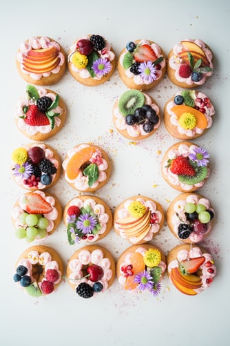

# authoring
## GitHub Flavoured Markdown.
# Ingredients:

- [x] External link 
- [x] Internal link
- [x] Images
- [x] Emojis
- [x] Tables 

# External link:

The [link](https://help.github.com/en) for externa documentation.

# Internal link:

# Images:

# Emojis:

:relaxed: 

# Table:

Desserts | Difficulty
----------|-----------
Lemon pie | medium
Chocolate tarte | high
Apple pie | medium

* [Ingredients](#ingredients)
* [External-link](#external-link)
* [Images](#images)
* [Emojis](#emojis)
* [Table](#table)

